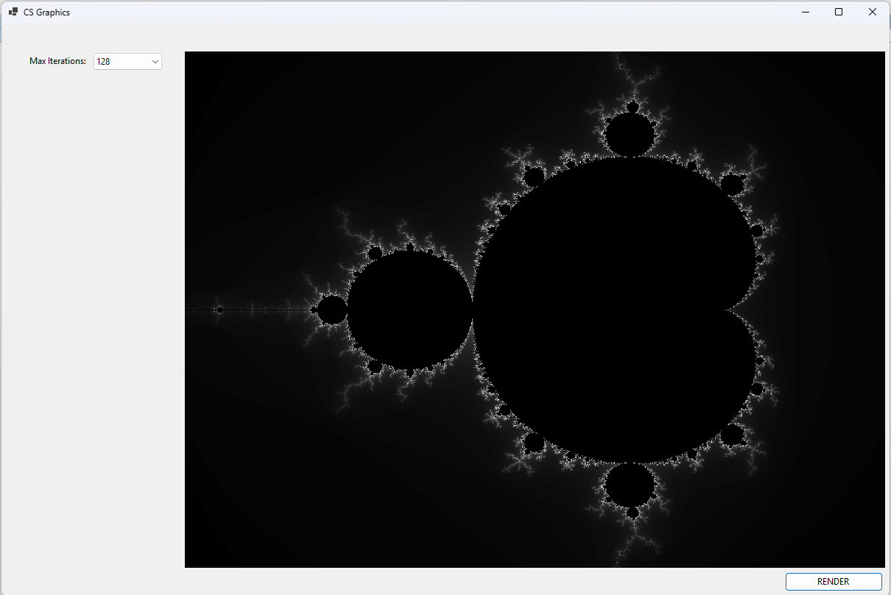

## CS_GRAPHICS

Fractals are special geometrical shapes created through iteration.

You take a simple starting rule and apply it over and over again.

One of the most famous fractals is the Mandelbrot set.

This project is a multi-threaded app to draw a simple Mandelbrot fractal.

Learning to implement a Mandelbrot fractal painter is a good C# beginner project. 

If you would like to know more, have a look at

## [C# Windows Forms App Development with .NET 10](https://www.udemy.com/course/learn-csharp-yaml-parsing)

Besides drawing a fractal, it also teaches you desktop app development with Windows Forms and C-Sharp.

Windows Forms is a quick way to get up and running with C# desktop app development.

Just make sure you know object oriented programming in C-Sharp and have Microsoft Visual Studio 2026 installed.
